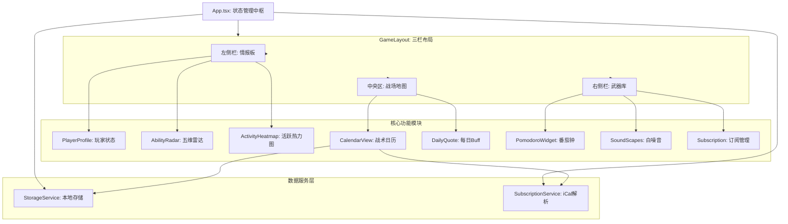

#  Cyber-Tech Life OS (PWA) 产品报告

---

## ① 产品功能介绍 (Product Features)

### 1.1 产品定位
**Cyber-Tech Life OS** 是一款专为 **18-24岁大学生、极客及效率追求者** 打造的“人生重构系统”。它打破了传统日历枯燥乏味的刻板印象，将时间管理工具与 **RPG 游戏化体验** 深度融合，旨在通过沉浸式的 **赛博朋克 HUD 界面**，让用户像指挥官一样掌控自己的生活。

### 1.2 核心功能矩阵

#### 游戏化成长系统 (Gamification)
*   **身份代入**：用户化身为系统指挥官，拥有专属的机甲头像和等级勋章。
*   **XP 经验机制**：每完成一项任务，系统自动结算 XP 经验值，支持从 Lv.1 菜鸟晋升为 Lv.99 战术大师。
*   **HEX-5 战术雷达**：实时分析用户近期行为，生成 **智力(INT)/力量(STR)/魅力(CHR)/耐力(VIT)/精神(MND)** 五维属性图，直观展示能力分布。
*   **勋章墙**：达成特定成就（如连续打卡、高强度任务）自动解锁荣誉徽章。

####  战术日历与情报 (Tactical Command)
*   **HUD 战术地图**：基于 React Big Calendar 深度定制的赛博风格日历，支持月/周/日多维视图切换。
*   **全息事件条**：高亮显示的能量条风格任务，支持拖拽排期和快速录入。
*   **网络情报接入**：支持通过 **iCal 协议** 订阅外部日历（如学校课表、公共假期），自动将“外部情报”合并至战术地图。

####  专注终端 (Focus Terminal)
*   **Red Alert 番茄钟**：常驻右侧的红色警戒倒计时，点击即刻进入心流状态。
*   **神经元降噪 (Neural Soundscapes)**：内置白噪音与赛博雨声生成器，一键屏蔽宿舍或图书馆的嘈杂干扰。
*   **高危任务预警**：自动计算重要 Deadline（如期末考试）的剩余时间，红色倒计时强力提醒。

---

## ② 程序概要设计 (Design Overview)

### 2.1 UI/UX 设计理念：Cyber-Tech HUD
本产品完全摒弃了传统的 Material Design 或 Flat Design，采用 **FUI (Future User Interface)** 设计语言。
*   **视觉风格**：以深空黑为底色，辅以 **霓虹青 (Cyber Cyan)** 为主色调，**警戒红 (Danger Red)** 为强调色。
*   **交互隐喻**：所有窗口均为“悬浮终端”，按钮具有机械反馈感，数据展示采用“扫描线”和“故障艺术 (Glitch)”效果。
*   **沉浸式布局**：采用 **三栏式战术布局 (Left-Main-Right)**，模拟游戏中的 HUD 界面，信息一目了然。

### 2.2 交互逻辑设计
*   **键盘优先 (Keyboard First)**：针对极客用户，支持 Vim 风格快捷键（`N` 新建, `P` 番茄钟, `S` 统计），极大提升操作效率。
*   **即时反馈**：任何操作（保存、删除、完成）均伴随 XP 结算或视觉微动效，提供强烈的操作爽感。

---

## ③ 软件架构图 (Software Architecture)

### 3.1 技术栈概览
*   **前端框架**: React 18 + TypeScript
*   **构建工具**: Create React App (CRA) -> Webpack
*   **日历引擎**: react-big-calendar + moment.js
*   **样式方案**: CSS3 Variables + Flexbox/Grid + CSS Animations
*   **数据存储**: LocalStorage (纯本地持久化)
*   **PWA 支持**: Workbox (Service Worker)

### 3.2 组件架构图

---

## ④ 技术亮点及其实现原理 (Technical Highlights)

### 4.1 动态五维雷达图 (Dynamic SVG Radar)
*   **原理**：不依赖庞大的 ECharts 或 Chart.js 库，完全使用 **原生 SVG** 绘制。
*   **算法**：
    1.  遍历最近 30 天的历史事件。
    2.  基于 NLP 关键词匹配（如“代码”->智力，“健身”->力量）计算各维度权重。
    3.  使用三角函数 (`Math.cos`, `Math.sin`) 计算 SVG 多边形顶点坐标。
    4.  应用 CSS 动画实现呼吸灯效果。
*   **优势**：包体积极小，性能极高，且风格完全可控。

### 4.2 无依赖 iCal 解析器 (Lightweight iCal Parser)
*   **原理**：为了避免引入臃肿的第三方库，手动实现了一个轻量级的 `.ics` 文件解析引擎。
*   **实现**：
    1.  使用 `fetch` 获取外部订阅源文本。
    2.  通过正则状态机解析 `BEGIN:VEVENT` 到 `END:VEVENT` 块。
    3.  提取 `DTSTART`, `SUMMARY`, `DESCRIPTION` 等关键字段并转换为 JavaScript Date 对象。
*   **优势**：无需后端代理即可在前端解析标准 iCal 协议数据。

### 4.3 渐进式 Web 应用 (PWA)
*   **原理**：利用 Service Worker 拦截网络请求并缓存核心资源。
*   **效果**：
    1.  支持**离线访问**，断网状态下依然可以查看日程和使用番茄钟。
    2.  支持**安装到桌面**，在 Windows/macOS/Android 上像原生 App 一样运行，无浏览器地址栏干扰。

### 4.4 神经元白噪音合成 (Neural Soundscapes)
*   **原理**：利用 Web Audio API (`AudioContext`) 实时生成音频。
*   **实现**：通过 `ScriptProcessorNode` 生成随机噪声（White/Pink Noise），经过 `GainNode` 调整增益，模拟出真实的雨声和电流声环境。
*   **优势**：无需加载 MP3 音频文件，节省流量且无限循环不卡顿。

### 4.5 战术大屏与生物节律 (Tactical Dashboard & Biorhythm)
*   **原理**：全屏遮罩层与 CSS 变量动态切换。
*   **实现**：
    1.  **屏保**：监听全局 `mousemove`/`keydown` 事件，防抖动 (Debounce) 检测用户活跃度，超时自动挂载全屏组件。
    2.  **节律**：`useEffect` 定时器每分钟检查系统时间，若处于 18:00-06:00，动态向 `body` 添加 `.biorhythm-night` 类，通过 CSS Variable 覆盖全局主色调（青色 -> 琥珀橙）。

### 4.6 全局微交互 (Micro-Interactions)
*   **点击爆炸**：在根节点监听 `click` 事件，动态计算鼠标坐标，生成一组 DOM 粒子节点并应用爆炸动画 (`transform` + `opacity`)，动画结束后自动销毁节点，防止内存泄漏。
*   **每日简报**：利用 `localStorage` 记录最后简报日期，实现“每日仅一次”的逻辑；打字机效果通过 `setInterval` 逐字截取字符串实现。

---

**Life OS v2.0** 不仅仅是一个日历，它是一次将生活数据化、可视化的技术尝试，旨在用最酷的方式，解决最枯燥的时间管理问题。
