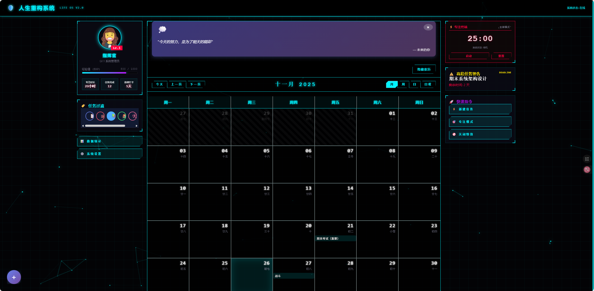

# 🛡️ Cyber-Tech Life OS (PWA)

> **"Not just a calendar, it's your life's tactical command center."**

这是一个基于 **React + TypeScript** 构建的现代化 PWA 日历应用，现已全面升级为 **v2.0 赛博战术指挥系统**。专为极客、大学生和追求极致效率的用户打造，采用沉浸式游戏化 HUD 界面。



## ⚡ 核心特性 (Core Features)

### 1. 🎮 游戏化战术界面 (Gamified HUD)
*   **三栏式指挥中心**：左侧情报板、中央战场地图、右侧武器库。
*   **角色成长系统**：
    *   **Level Up**：完成任务获取 XP，从 Lv.1 系统管理员开始晋升。
    *   **专注统计**：实时追踪你的专注时长，可视化你的努力。
*   **全息视觉**：深色赛博朋克风格，霓虹光效，Glitch 故障艺术，动态粒子背景。

### 2. 📅 战术日历 (Tactical Calendar)
*   **高亮显示**：拖拽创建事件，全息能量条风格的任务展示。
*   **农历支持**：内置中国农历算法，重要节日不遗漏。
*   **多维视图**：月/周/日/议程视图无缝切换。

### 3. 🍅 专注终端 (Focus Terminal)
*   **常驻挂件**：右侧常驻番茄钟，随时进入心流状态。
*   **Red Alert 模式**：全屏沉浸式红色警戒倒计时。
*   **高危任务预警**：自动计算 Deadline 剩余时间，红色倒计时提醒。

### 4. ⚡ 快速指令 (Quick Actions)
*   **键盘优先**：支持 Vim 式快捷键操作（`N` 新建, `P` 番茄钟, `S` 统计）。
*   **PWA 离线能力**：支持安装到桌面，断网依然可用。
*   **本地加密存储**：数据完全存储在本地 `localStorage`，隐私绝对安全。

## 🛠️ 技术栈 (Tech Stack)

*   **Core**: React 18, TypeScript
*   **Build**: Create React App (CRA)
*   **Calendar Engine**: react-big-calendar, moment.js
*   **Styling**: CSS3 Variables, Flexbox/Grid, Animations
*   **PWA**: Workbox

## 🚀 快速开始 (Quick Start)

### 安装依赖
```bash
npm install
```

### 启动开发服务器
```bash
npm start
```
访问 `http://localhost:3000` 即可进入指挥系统。

### 构建部署
```bash
npm run build
```

## ⌨️ 战术快捷键 (Shortcuts)

| 按键 | 指令 |
|------|------|
| **N** | 新建任务 (New Mission) |
| **P** | 开启/关闭番茄钟 (Pomodoro) |
| **T** | 专注模式 (Today Focus) |
| **S** | 查看统计 (Statistics) |
| **B** | 切换粒子特效 (Background FX) |
| **D** | 切换深色模式 (Dark Mode) |
| **?** | 帮助菜单 |
| **ESC**| 关闭所有弹窗 |

## 📄 开源协议
MIT License
